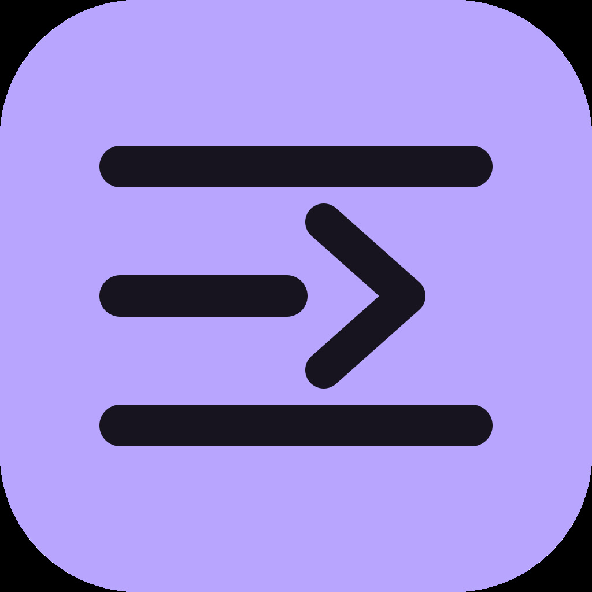

# Cutmark



Cutmark is a browser-based video editor for trimming clips and polishing them with optional scene detection and captions. Set precise in and out points, review the result, and export an MP4.

**Try it live:** [cutmark.dev](https://cutmark.dev)

## Features

- Import MP4, MOV, WebM, and MKV videos.
- Set an exact trim range by dragging the timeline or entering timecodes.
- Preview the selected range and jump to detected scene changes.
- Export clips as MP4.
- Optionally detect scene changes and generate editable captions.
- Reopen recent projects saved in the current browser.
- Keep video processing on the device; source clips are not uploaded to an application server.

## Technologies

- Next.js, React, TypeScript, and Tailwind CSS
- WebCodecs for browser video encoding when supported
- FFmpeg WebAssembly as a video processing fallback
- Transformers.js and Whisper Tiny English for speech transcription
- IndexedDB for recent project history
- AWS CDK, Amazon S3, and Amazon CloudFront for hosting

## The Process

I built Cutmark as a static Next.js app so the editor can run without a video-processing backend. The browser uses WebCodecs when available and falls back to FFmpeg WebAssembly for trimming and encoding. Scene detection and speech transcription are optional steps, so the basic export workflow can stay lightweight.

Recent projects are stored in IndexedDB in the browser. New projects keep the source clip and edit settings so they can be reopened and edited later. The source clip stays on the user's device; the English speech model is downloaded from Hugging Face the first time captions are generated. Repeated word sequences are limited to prevent speech recognition loops from filling the transcript.

For deployment, the site is exported as static files and served from a private S3 bucket through CloudFront. GitHub Actions builds the frontend and deploys it when changes reach `main`.

## What I Learned

Building a video editor in the browser meant working around differences in codec support and available hardware. Using WebCodecs with an FFmpeg fallback gave the app another path when a browser cannot encode a particular video.

I also learned to treat video files as large local data: project history needs browser storage, and editing a saved project requires keeping its source clip as well as its export. Deploying a static Next.js app through S3 and CloudFront gave me a simple way to publish updates through GitHub Actions.

## Running the Project

```bash
git clone https://github.com/KrishTday/Cutmark.git
cd Cutmark/frontend
npm ci
npm run dev
```

Open [http://localhost:3000](http://localhost:3000) in your browser. To check the production build or run lint:

```bash
npm run build
npm run lint
```

Caption generation downloads the Whisper Tiny English model on first use. It transcribes English speech; browser codec support and local storage capacity vary by device.

## License

MIT. See [LICENSE](LICENSE).
