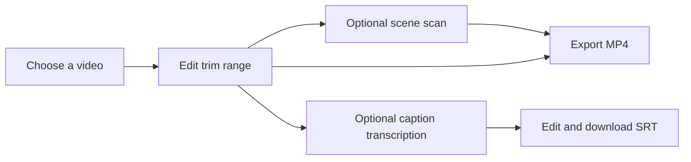

# Cutmark

Cutmark is a browser-based video editor for making a clean clip from a longer video. Set precise in and out points, preview the selected range, and export an MP4. Scene detection and caption generation are optional, so you can keep the editing workflow fast when you do not need them.

## Features

- Import MP4, MOV, WebM, and MKV videos.
- Set trim points by dragging the timeline handles or entering timecodes.
- Preview and play only the selected range.
- Use keyboard controls to adjust the focused trim point.
- Scan for likely scene changes, jump between detected cuts, and snap trim points to them.
- Optionally transcribe English speech and edit caption text and timing before downloading an SRT file.
- Export the selected video range as MP4.
- Reopen or delete recent projects saved in the browser.
- Show separate progress for video processing, scene detection, and captions.

## Getting started

Install dependencies and start the development server:

```bash
npm install
npm run dev
```

Open [http://localhost:3000](http://localhost:3000) in your browser.

## How it works

Cutmark is a statically exported Next.js application. Video trimming and encoding use FFmpeg WebAssembly in the browser. Scene detection samples the video at a reduced resolution to keep the scan responsive; very brief cuts may not be detected. Caption generation uses Transformers.js and Whisper Tiny, and downloads the speech model on first use. You can leave captions and scene detection disabled to avoid their extra processing.

Videos and recent project data stay in browser storage; the app does not upload source videos to an application server. Browser storage is local to the current browser and device.



## Built with

- Next.js, React, TypeScript, and Tailwind CSS
- FFmpeg WebAssembly for video processing
- Transformers.js and Whisper Tiny for speech transcription
- IndexedDB for recent project history
- AWS CDK, Amazon S3, and Amazon CloudFront for the hosting infrastructure

## License

MIT. See [LICENSE](LICENSE).
