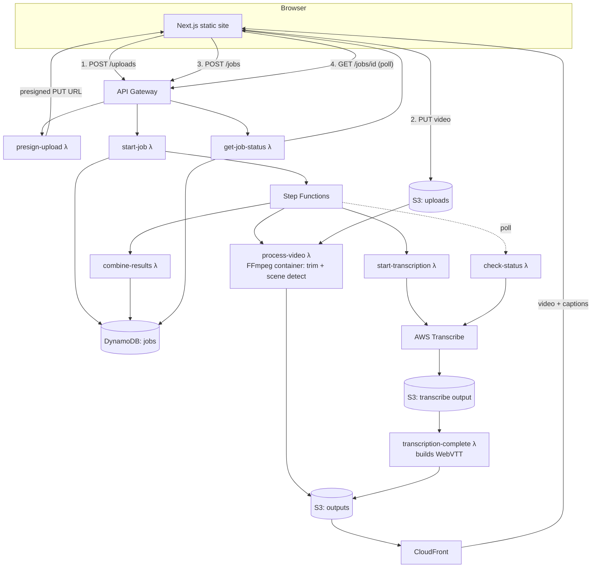

# Splice

A web video editor that trims a clip and hands it to AWS for two things a person
would otherwise do by hand: finding the scene cuts and writing the captions.

Upload a video, drag the in/out handles, hit **Process clip** — a Step Functions
pipeline trims the file with FFmpeg, detects scene changes, and runs AWS
Transcribe for captions, then the browser polls for the result and lets you
download the finished clip.

**Stack:** Next.js (static export) · AWS Lambda · Step Functions · S3 · CloudFront · DynamoDB · AWS Transcribe · FFmpeg · AWS CDK

---

## Why it's built this way

The brief was to make it fast — the frontend is a static export (`next export`)
served straight from S3/CloudFront, so there's no server round-trip for the
page itself, only for the two or three API calls the editor actually needs.
Video never passes through a server either: the browser uploads directly to S3
with a presigned URL, and downloads the result straight from CloudFront.

Both "AI" features are real, not mocked:

- **Captions** come from **AWS Transcribe**, a genuine speech-to-text model.
  The Lambda in `transcription-complete` converts Transcribe's word-level JSON
  output into WebVTT itself, rather than relying on Transcribe's built-in
  subtitle export, so caption timing is fully under this codebase's control.
- **Scene detection** uses FFmpeg's content-aware scene filter
  (`select='gt(scene,0.4)'`), a deterministic frame-difference algorithm, not
  a neural network. It's described that way throughout this repo — worth
  knowing if you're using this project to talk about "AI features" in an
  interview.

## Architecture



## Repository layout

```
frontend/          Next.js app (App Router, static export, Tailwind)
infrastructure/     AWS CDK app (TypeScript) - all infra as code
  bin/app.ts         CDK entrypoint
  lib/splice-stack.ts  the whole stack: S3, DynamoDB, API GW, Step Functions, CloudFront
  lambda/            one folder per Lambda function
.github/workflows/  CI, and CD for both the frontend and the infra
```

## Running the frontend locally

```bash
cd frontend
npm install
cp .env.example .env.local   # point NEXT_PUBLIC_API_URL at a deployed API, or run against a local stub
npm run dev
```

Without a deployed backend, the editor UI still loads and lets you trim
locally, but uploading requires a real `NEXT_PUBLIC_API_URL`.

## Deploying the backend

Requires an AWS account, the AWS CLI configured, Node 20, and Docker running
locally (the scene-detection Lambda is a container image built at deploy
time).

```bash
cd infrastructure
npm install
npx cdk bootstrap                 # once per account/region
npx cdk deploy --all
```

This provisions everything in the diagram above and prints outputs including
`ApiUrl`, `SiteUrl`, `SiteBucketName` and `SiteDistributionId`.

Deploy the frontend build to the bucket CDK just created:

```bash
cd frontend
NEXT_PUBLIC_API_URL=<ApiUrl from cdk output> npm run build
aws s3 sync out s3://<SiteBucketName> --delete
aws cloudfront create-invalidation --distribution-id <SiteDistributionId> --paths "/*"
```

### Continuous deployment (optional)

`.github/workflows/deploy-infra.yml` and `deploy-frontend.yml` do the two
steps above automatically on push to `main`. They assume an IAM role via
GitHub's OIDC provider rather than long-lived AWS keys:

```bash
# once: create an OIDC-federated role GitHub Actions can assume.
# trust policy should restrict to your repo, e.g.
#   "token.actions.githubusercontent.com:sub": "repo:<you>/<repo>:ref:refs/heads/main"
# and the role needs permissions to deploy the CDK stack (CloudFormation,
# S3, Lambda, IAM, DynamoDB, Step Functions, CloudFront, Transcribe, ECR).
```

Set the role's ARN as the repo secret `AWS_DEPLOY_ROLE_ARN` (and optionally an
`AWS_REGION` repo variable). The frontend workflow reads the API URL and
bucket name directly from the deployed stack's CloudFormation outputs, so
there's nothing to keep in sync by hand after an infra change.

## Cost

Everything here is pay-per-use (Lambda, Step Functions, S3, API Gateway HTTP
API, DynamoDB on-demand, CloudFront, Transcribe billed per second of audio).
There's no idle server. A few short test clips costs cents; `cdk destroy --all`
tears down every resource, including the S3 buckets (they're configured to
auto-delete their contents).

## Known limitations

- Video upload is capped by whatever `ALLOWED_CONTENT_TYPES` in
  `presign-upload` accepts (MP4, MOV, WebM, MKV) and by Lambda's 10-minute
  processing timeout, which bounds practical clip length.
- No auth - anyone with the site URL can submit jobs. Fine for a portfolio
  demo, not for a public product.
- Transcribe runs on the full source audio while FFmpeg trims separately, so
  `transcription-complete` filters the transcript down to `[trimStart,
  trimEnd)` and re-offsets every timestamp to line captions up with the
  trimmed clip - if you extend the pipeline, keep that filtering in mind
  rather than assuming Transcribe's timestamps are already clip-relative.
- The `process-video` Dockerfile was written and reviewed carefully but not
  build-tested against a live registry in this environment (no network
  access here). Before your first `cdk deploy`, it's worth running
  `docker build infrastructure/lambda/process-video` locally to confirm the
  `mwader/static-ffmpeg` binary paths still match; CDK will build it as part
  of `cdk deploy` regardless, so this just catches it earlier.

## License

MIT — see [LICENSE](LICENSE).
