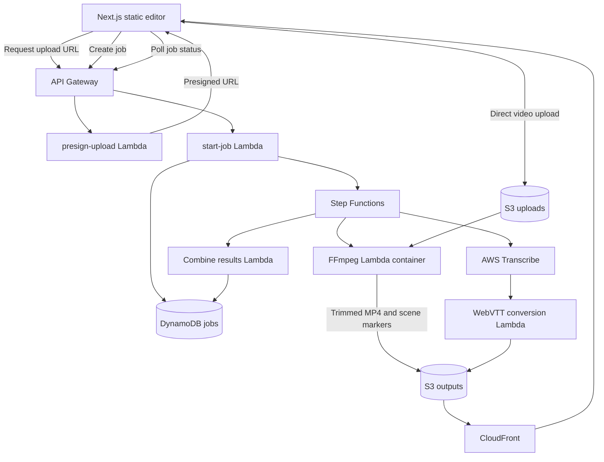

# Splice

**A serverless video editor that trims clips, detects scene changes, and generates timed captions.**

Splice lets you upload a video, select an in/out range, and process the clip. FFmpeg creates the trimmed MP4 and detects scene cuts; AWS Transcribe generates speech captions, which the backend filters to the selected range and converts to WebVTT.

> Portfolio project demonstrating a static Next.js frontend, direct-to-S3 uploads, asynchronous AWS workflows, media processing, and infrastructure as code.

**Stack:** TypeScript · Python · JavaScript · CSS · Next.js · AWS

## Demo

Add a short screen recording here once captured, for example:

```md
[Watch the Splice demo](<your demo link>)
```

Suggested 30–60 second walkthrough: select a sample clip, set the in/out points, process it, show detected scene markers, and download/play the result with captions. Use a clip you have permission to share. Add screenshots under `docs/screenshots/` and embed them here when available.

## What it demonstrates

- Static Next.js export hosted on S3 and CloudFront.
- Browser-to-S3 uploads using presigned URLs, so video bytes do not pass through the API.
- AWS Step Functions coordinating independent video and transcription branches.
- FFmpeg trimming and deterministic scene detection using `select='gt(scene,0.4)'` (frame-difference scoring, not a neural network).
- AWS Transcribe speech recognition and custom conversion of word-level timestamps to WebVTT.
- AWS CDK infrastructure and CI/CD workflows using GitHub Actions OIDC.

## Architecture



## Run locally

Requirements: Node.js 20 or newer. To run the frontend against a deployed API:

```bash
cd frontend
npm ci
```

Create `frontend/.env.local` with the deployed API endpoint:

```env
NEXT_PUBLIC_API_URL=https://your-api-id.execute-api.your-region.amazonaws.com
```

Then start the editor:

```bash
npm run dev
```

Without a deployed API, the page can be explored but upload and processing will not work. The repository also includes a Docker Compose mock backend; it simulates completion and does not run FFmpeg or AWS Transcribe. See [`infrastructure/LOCALSTACK_SETUP.md`](infrastructure/LOCALSTACK_SETUP.md) for the local-development notes.

## Checks

Run the infrastructure unit checks and type check with:

```bash
cd infrastructure
npm test
npx tsc --noEmit
```

The unit tests cover trim range validation and caption filtering/timestamp offsets. CI also synthesizes the CDK app and builds/lints the frontend.

## Resume summary

> Built a serverless video editor with a Next.js static frontend and AWS CDK backend, using direct-to-S3 uploads and Step Functions to coordinate FFmpeg clip trimming/scene detection with AWS Transcribe captions.

Keep the description aligned with what you personally built and have verified. Scene detection is a deterministic FFmpeg filter; captions use AWS Transcribe.

## Limitations and follow-up

- The API and upload bucket are currently open to anyone who can reach the endpoints; this is suitable for a controlled portfolio demo, not a public production service.
- Input types are limited by the allowlist in `presign-upload`, and practical clip duration is bounded by Lambda processing time.
- Transcribe processes the source audio while FFmpeg trims the video, so the caption Lambda filters transcript words into `[trimStart, trimEnd)` and shifts their times to the output clip.
- S3 lifecycle rules remove uploads/transcribe data after one day and outputs after seven days.
- A production version should add authentication, quotas, and tighter CORS origins.

## Cost and cleanup

AWS resources use pay-per-use pricing, including Lambda, Step Functions, S3, API Gateway, DynamoDB, CloudFront, and Transcribe. Review expected charges in your account. To remove the deployed stack and its resources:

```bash
cd infrastructure
npx cdk destroy --all
```

## License

MIT. See [LICENSE](LICENSE).
