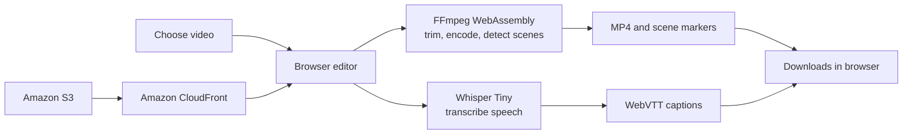

# Splice

Splice is a browser-based video editor that trims a clip, marks scene changes, and creates timed English captions. FFmpeg WebAssembly and Whisper Tiny process the selected media on the user's device, without uploading the video to an application server.

## Features

- Preview MP4, MOV, WebM, and MKV videos.
- Set clip in and out points on an interactive timeline.
- Detect likely scene changes and display them as timeline markers.
- Transcribe English speech and create WebVTT captions.
- Export the trimmed video as MP4 and download the captions separately.
- Keep the source video and processing results in the browser.

## How it works

The editor is a statically exported Next.js application. FFmpeg WebAssembly handles video processing, while Transformers.js runs Whisper Tiny for speech recognition. The model is fetched on first use and may be cached by the browser. Only the static site is hosted on AWS; video editing, scene detection, and transcription happen in the browser.

## Built with

- **Frontend:** Next.js, React, TypeScript, Tailwind CSS
- **Media processing:** FFmpeg WebAssembly
- **Speech recognition:** Transformers.js, Whisper Tiny
- **Hosting infrastructure:** AWS CDK, Amazon S3, Amazon CloudFront

## License

MIT. See [LICENSE](LICENSE).
